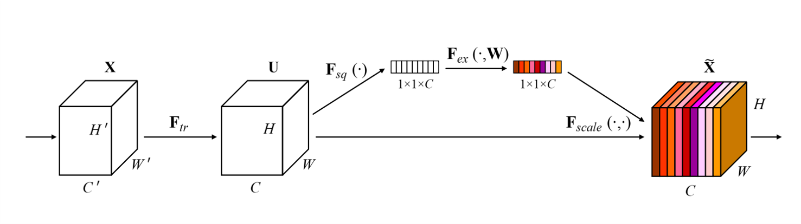
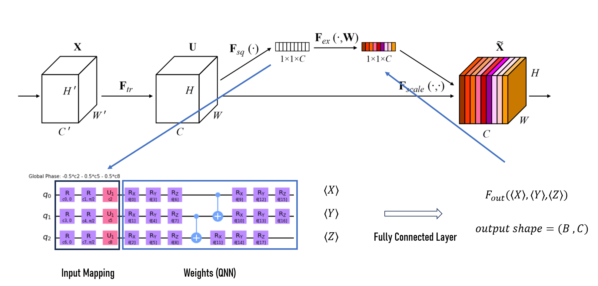

# QNN
Code for quantum machine learning hackathon 

## Classical SE Layer

## Quantum SE Layer

## Reference Paper
- [Squeeze-and-Excitation Networks](https://arxiv.org/abs/1709.01507)
- [Pennylane](https://pennylane.ai/)
- [PyTorch Documentation](https://pytorch.org/docs/stable/index.html)
